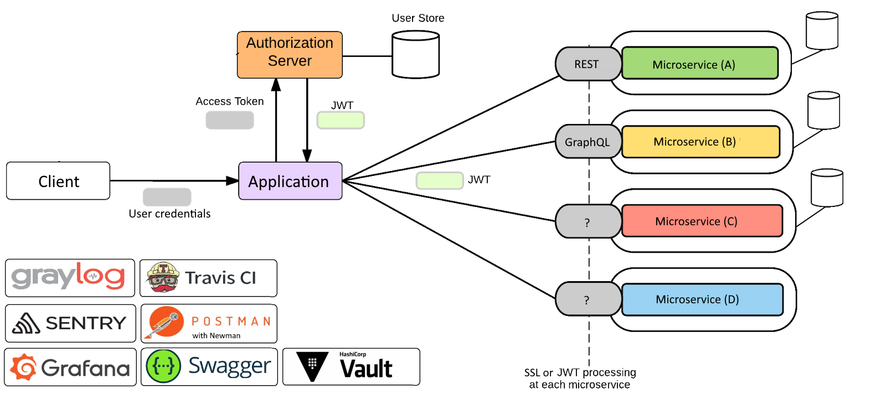

Service oriented architecture
=======
Microservices architecture has been gaining a lot of ground as the preferred architecture for implementing solutions, as it provides benefits like scalability, logical and physical separation, small teams managing a part of the functionality, flexibility in technology, etc. 
But since microservices are distributed the complexity of managing them increases.
One of the key challenges is how to implement authentication and authorization in microservices so that we can manage security and access control.

# Auth service

In this strategy, a microservice is created for the purpose of authentication. Authentication primarily involves issuing and verifying tokens. 
JWT (JSON Web Tokens) can be used to verify tokens without having to hit a database or other persistent storage. 
This means each service can verify requests on their own. Token issuing is done in the auth service, while verification is handled in every service where it’s required. 
A client library is usually used to share this verification functionality with all the services that need to perform authentication. 

# Notification service

...

# Admin Panel service

...

# Verification service 
   
...

# Application

...   
    
## Author
[Dykyi Roman](https://www.linkedin.com/in/roman-dykyi-43428543/), e-mail: [mr.dukuy@gmail.com](mailto:mr.dukuy@gmail.com)

