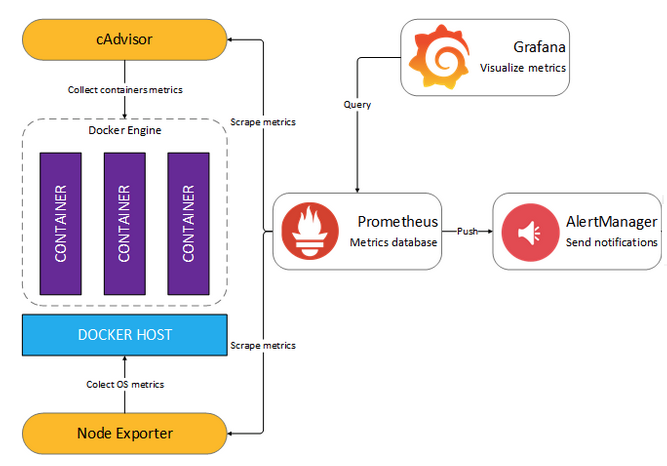

Service oriented architecture
=======


- - -
[](https://travis-ci.org/github/dykyi-roman/service-oriented-architecture)
[](https://github.com/dykyi-roman/service-oriented-architecture/blob/SOA-app/LICENSE)
[](https://php.net/)
- - -

Microservices architecture has been gaining a lot of ground as the preferred architecture for implementing solutions, 
as it provides benefits like scalability, logical and physical separation, small teams managing a part of the functionality, flexibility in technology, etc. 
But since microservices are distributed the complexity of managing them increases.
One of the key challenges is how to implement authentication and authorization in microservices so that we can manage security and access control.

Avoid extensive APIs. If the microservice is getting too complicated, then you are giving the service too much functionality.
The goal is to have a series of services that can be strung together to meet the needs of future business problems.

I clearly understand that this is a not silver bullet. Clean Architecture by Robert C. Martin has a good describe base problems.
Here I want to add some plus from me:
* small and single in purpose;
* communicate via technology agnostic protocols;
* support continuous integration;
* independently deployable.

# Architecture


### Layered architecture 
The most common architecture pattern is the layered architecture pattern, otherwise known as the n-tier architecture pattern. 
This pattern is the de facto standard for most Java and PHP enterprise applications. 
The layered architecture pattern closely matches the traditional IT communication and organizational structures found in most companies, making it a natural choice for most business application development efforts. 
 
### DDD
Often layered architecture comes with the concept DDD. Domain-driven design (DDD) advocates modeling based on the reality of business as relevant to your use cases. 
DDD talks about problems as domains. It describes independent problem areas as Bounded Contexts (each Bounded Context correlates to a microservice), and emphasizes a common language to talk about these problems.
It also suggests many technical concepts and patterns, like domain entities with rich models (no anemic-domain model), value objects, aggregates and aggregate root (or root entity) rules to support the internal implementation. 
This section introduces the design and implementation of those internal patterns. 
 
# Services

[Application service](application/README.md)

[Auth service](auth/README.md)

[Message service](message/README.md)

[Cloud-storage service](cloud-storage/README.md)

[Admin panel service](adminpanel/README.md)

# Tools

[Sentry](sentry/README.md)

[Graylog](graylog/README.md)

<a href="https://github.com/dykyi-roman/service-oriented-architecture/tree/master#newman">Newman</a>

[Metrics](metrics/README.md)

[Travis CI](https://travis-ci.org/github/dykyi-roman/service-oriented-architecture)

[Vault](vault/README.md) 
 
# Application

Service that combines work with microservices.

Auth:
 - login
 - sign up
 - password restore
 
Messages:
 - send message operation
 
Cloud storage:
 - storage for user uploaded files

# Auth service


In this strategy, a microservice is created for the purpose of authentication. Authentication primarily involves issuing and verifying tokens. 
JWT (JSON Web Tokens) can be used to verify tokens without having to hit a database or other persistent storage. 
This means each service can verify requests on their own. Token issuing is done in the auth service, while verification is handled in every service where it’s required. 
A client library is usually used to share this verification functionality with all the services that need to perform authentication. 

When you take a JWT from the authorization server you can use it for communicating with another service, putting token inside a request header. Or you can use the SSL certificate between microservices and left the problem of security for DevOps.

## Authenticate between microservice    


For more information, click [here](auth/README.md).

# Message service


For more information, click [here](message/README.md).

# Admin Panel service


Exist a lot of ways how you can organize architecture to work with the admin panel.
I have experience working with four. Taking into consideration the first of the SOLID principles (Single Responsibility Principle) on the modules level I would take for realization approach №2.
On the picture use a REST for data transfer between a service but this is a detail, request/response can easily be implemented by using messaging. 

For more information, click [here](adminpanel/README.md).

# Cloud storage service 
   


Cloud storage is a service model in which data is transmitted and stored on remote storage systems, where it is maintained, managed.
Service provide API for easy connect and use base methods cloud or file storage.

For more information read [here](cloud-storage/README.md).

## Sentry

Sentry provides self-hosted and cloud-based error monitoring that helps all software teams discover, triage, and prioritize errors in real-time.

## Graylog

Graylog is a leading centralized log management solution built to open standards for capturing, storing, and enabling real-time analysis of terabytes of machine data.

## Newman

<a href="https://github.com/postmanlabs/newman" target="_blank">Newman</a> is a command-line collection runner for
<a href="https://getpostman.com" target="_blank">Postman</a>. It allows you to effortlessly run and test a
<a href="https://www.getpostman.com/docs/collections" target="_blank">Postman Collections<a/> directly from the
command-line. It is built with extensibility in mind so that you can easily integrate it with your continuous integration servers and build systems.

Run a collection using the newman image:

```
docker-compose run postman_checks
```

## Swagger

Swagger provides more benefits than just helping create clear API documentation for users, teams, and enterprises with the Swagger open source and professional toolset. 
Find out how Swagger can help you design and document your APIs at scale. Link on the official documentation you find [here](https://swagger.io/).

## Metrics(Prometheus+Grafana+AlertManager+Node-exporter+Cadvisor+...)



Monitoring helps me ensure that all my services in good health. For that, I use a collection of metrics, and the presentation of these metrics in a convenient form (tables, graphs, scales, notifications, reports).
The more components in my system (microservices), the greater the load on it, the more expensive the downtime, the more important it is to have a good monitoring system.
Prometheus is not a “set-up and works” solution. This is a platform, a set of tools that allows you to do the monitoring you need.

## Travis CI

I host the source code for almost all of my projects on GitHub and have Travis CI run automated tests as soon as the code there is updated. 
This help me ensure the quality of our code and simplifies the automation of related tasks, such as releasing new versions of my software. 
Another advantage for me with Travis CI is that the service is free for open source projects, and most of my code is open source.

## Vault

One of the most difficult things in any kind of application (not just web applications) is how to protect "secret" values. 
These values might be API keys, database passwords or even special bypass codes. 
Ideally, you're not having to define these directly in the application and can have them loaded from another source.

In PHP applications there's a common pattern to keep configuration values and access details in a `.env` file that resides in a place where the PHP application can reach it.

!!! Before using this technology, you need to remember about a network communication and php specification work (PHP born to die. And each request for the server will be like a new).

For more information, click [here](vault/README.md).

## Resources:

[Messaging Patterns for Event-Driven Microservices](https://solace.com/blog/messaging-patterns-for-event-driven-microservices/)

[REST vs Messaging for Microservices – Which One is Best?](https://solace.com/blog/experience-awesomeness-event-driven-microservices/)

[Create an SSL Certificate on Nginx](https://www.digitalocean.com/community/tutorials/how-to-create-an-ssl-certificate-on-nginx-for-ubuntu-14-04)

[json-schema](https://json-schema.org/understanding-json-schema/reference/object.html)

[Newman](https://github.com/postmanlabs/newman)

[Grafana](https://grafana.com/docs/grafana/latest/features/panels/panels/)

[Swagger](https://medium.com/@nyllor/generate-openapi-documentation-for-your-php-api-45f526f3975c)

[Super speed nginx](https://gnugat.github.io/2016/04/20/super-speed-sf-nginx.html)

[Travis](https://docs.travis-ci.com/user/job-lifecycle/)
    
## Author
[Dykyi Roman](https://www.linkedin.com/in/roman-dykyi-43428543/), e-mail: [mr.dukuy@gmail.com](mailto:mr.dukuy@gmail.com)

