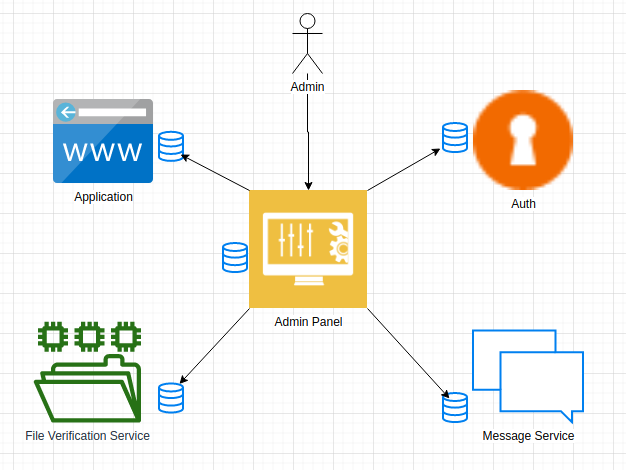
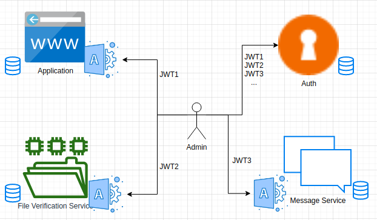
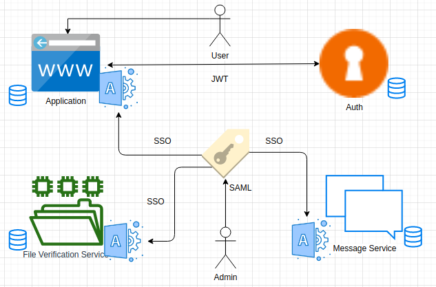

Admin panel service
=======

# Overview

Exist a lot of ways how you can organize architecture to work with the admin panel.
I have experience working with four. Taking into consideration the first of the SOLID principles (Single Responsibility Principle) on the modules level I would take for realization approach №2.

# Approach №1 (Single admin panel)

Simplest approach that uses in a lot legacy application. SRP broken, because the Admin panel knows about all service and his data. And do not matter you have a separate panel like microservice or your admin panel a part of your application.

# Approach №2 (Self admin panel + Global enter point)

Following this approach, we have an entry point (use a REST API) to all small admin panel services.
The global admin panel has a role aggregator.

# Approach №3 (Self admin panel + admin`s identity)

Following this approach, we still have an admin panel inside each service, but for easier enter, we should use the authentication service to entering in each service and remember all pairs (pass and login).

# Approach №4 (Self admin panel + SAML)

Following this approach, we still have an admin panel inside each service, but for easier enter we use SAML.

Security Assertion Markup Language (SAML) is a standard for logging users into applications based on their sessions in another context. This single sign-on (SSO) login standard has significant advantages over logging in using a username/password:

* No need to type in credentials

* No need to remember and renew passwords

* No weak passwords

### How it`s work

# Endpoints

| Path                    | Method | Scheme | Grant |
| ----------------------  | ------ | ------ | ----- |
| /api/...                | POST   | ANY    | ALL   |

## Requirements

* PHP 7.4
* Symfony 5.0

## Tests

* Postman
* Functional and unit tests (PHPUnit)

## Useful links

[SINGLE SIGN-ON WITH SAML STANDARDS](https://labs.tadigital.com/index.php/2018/11/05/single-sign-on-with-saml-standards/)
[SAML SSO Flow](https://developers.onelogin.com/saml)
    
## Author
[Dykyi Roman](https://www.linkedin.com/in/roman-dykyi-43428543/), e-mail: [mr.dukuy@gmail.com](mailto:mr.dukuy@gmail.com)
