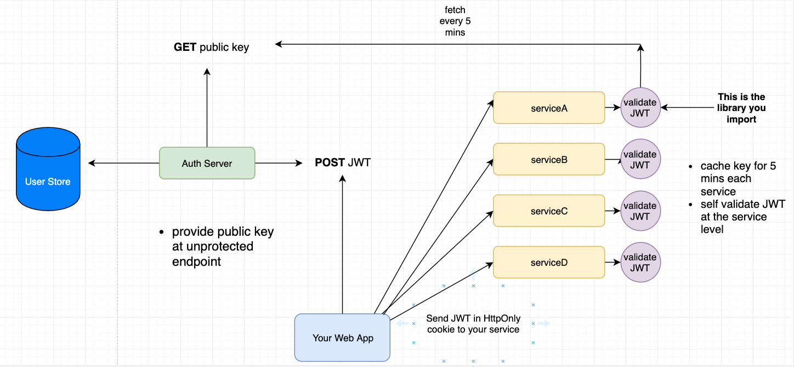

Use JWT to authenticate separate API Microservice
=======

There are two basic messaging patterns that microservices can use to communicate with other microservices.

* Synchronous communication. In this pattern, a service calls an API that another service exposes, using a protocol such as HTTP or gRPC. ...

* Asynchronous message passing.

In both ways, you should protect the communication Channel and save you a message from leaks.
As we moved from monoliths to microservices, we needed to centralize our authorization effort by creating an authorization service. 

## API Gateway

One common pattern here would be to use an API gateway as the entry point to your entire microservice architecture. 
Incoming requests for authentication would be routed to the appropriate microservice. 
If the credentials provided be correct, a new JWT would be returned to the gateway, which would then forward to the caller.
For the actual microservice APIs which comprise your application, the gateway would check that the incoming JWT be valid before allowing the request to hit the microservice. 

The API Gateway is the entry point to all the services that your application is providing. 
It’s responsible for service discovery (from the client side), routing the requests coming from external callers to the right microservices, 
and fanning out to different microservices if different capabilities were requested by an external caller (imagine a web page with dashboards delivered by different microservices).
If you take a deeper look at the API Gateways, you’ll find them to be a manifestation of the famous façade design pattern.

## Has a public key in each microservice

You could write a library that you import into your other microservices that requires all routes by default to require authentication. 
This library could have a mechanism to validate JWT's at the microservice level, so you never need to talk to your auth api to see if a JWT is valid or not. 
See the description and diagram below:

Your auth server will need to be the single issuer of JWTs to your microservices. 
So, when a user logs in and successfully authenticates, your auth server will issue a JWT signed with a private key (signing MUST be asymmetric - RS256 is one example) you keep on the auth server only;
do not give this private key to other microservices that you wish to validate JWTs inside of. 
What you can do is derive a public key based on the private key you sign your tokens with and publish that to an endpoint on your auth server that requires no authentication - the public key will be represented in the form of a JWK (see link to spec).
Google does something similar [here](https://www.googleapis.com/oauth2/v3/certs). 

Then, in each of your microservices, your library will need to devise a way to make a GET request to the public key endpoint on your auth server every X minutes to see if there are any changes and cache the public key in each microservice. 
By having the public key cached in your microservice, you will be able to validate the requesting JWT inside the service that is being requested.

## Use Vault storage

It's made by those amazing folks at Hashicorp. It's a secret store, but can also do OTL credentials for MySQL/AWS/other, act as a CA, do encryption-as-a-service etc. 
One great benefit is that you can deploy tokens to your servers that give them access to read from the vault (what they can read depends on the policies assigned to them). 
The tokens can be revoked any time, centrally. This means you can create & deploy new tokens frequently, and revoke the old ones once the new ones are in use. 
The vault is a single binary (written in Go) which can act as a server or a client, but you can also talk to the server using its HTTP API.

Oh, it needs to run on top of something like Consul (but can use other back-ends too). I'd recommend Consul by itself anyway - auto discovery of services via DNS, key/value store etc. Very cool.

Edit: to clarify, this is just a possible way to let your servers generate (or just read) a certificate from the vault. 
The certificate never exists on your servers. You grab it from the vault when you need it. 
And since the vault has audit logging, you know if it's been accessed outside of server restarts. 
The biggest issue with getting compromised is knowing when you've been compromised.

## Resources

[Securing Microservices: The API gateway, authentication and authorization](https://sdtimes.com/apis/securing-microservices-the-api-gateway-authentication-and-authorization/)
    
[Use JWT to authenticate separate API Microservice](https://stackoverflow.com/questions/56147281/use-jwt-to-authenticate-separate-api-microservice)    

[Common patterns for public key sharing in microservices?](https://www.reddit.com/r/devops/comments/4bmuii/common_patterns_for_public_key_sharing_in/)
    
[How We Solved Authentication and Authorization in Our Microservice Architecture](https://medium.com/technology-learning/how-we-solved-authentication-and-authorization-in-our-microservice-architecture-994539d1b6e6)    
    
## Author
[Dykyi Roman](https://www.linkedin.com/in/roman-dykyi-43428543/), e-mail: [mr.dukuy@gmail.com](mailto:mr.dukuy@gmail.com)
