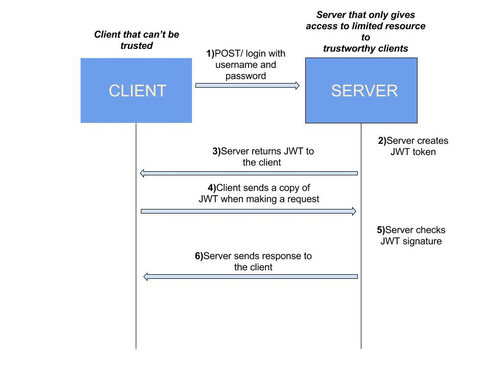

Auth service
=======



This part of the tutorials covers how to perform Authentication and Authorization between microservices.

Authentication: Refers to verify who you are, so you need to use username and password for authentication.

Authorization: Refers to what you can do, for example access, edit or delete permissions to some documents, and this happens after verification passes.

JWT: (Json Web Token) is an open standard (RFC 7519) that defines the Token format, defines the Token content, encrypts it, and provides lib for various languages.

Read more how is organized [authenticate between microservice](JWT.md)

## Configuration

Run migrations:

```
php bin/console doctrine:migrations:migrate 
```

## Endpoints

| Path                    | Method  | Scheme | Grant |
| ----------------------  | ------- | ------ | ----- |
| /api/user/registration  | POST    | ANY    | ALL   |
| /api/user/login         | POST    | ANY    | ALL   |
| /api/user//current      | GET     | ANY    | ALL   |
| /api/token/refresh      | POST/GET| ANY    | ALL   |
| /api/cert               | GET     | ANY    | ALL   |

## Requirements

* PHP 7.4
* Symfony 5.0
* MySQL

## Clients

MySQL open [https://localhost:8081](https://localhost:8888) and use login and password:

```
    server: auth_mysql_1
    user: root
    password: root
```

## Tests

* Postman
* Functional(PHPUnit)

## Code verification:

```
php vendor/bin/phpcs --standard=PSR2 ./src/
php vendor/bin/ecs check ./src/	--set clean-code
php vendor/bin/psalm
```

## Resources

[Microservices Authentication and Authorization Solutions](https://medium.com/tech-tajawal/microservice-authentication-and-authorization-solutions-e0e5e74b248a)

[Securing Microservices: The API gateway, authentication and authorization](https://sdtimes.com/apis/securing-microservices-the-api-gateway-authentication-and-authorization/)

[Authentication and Authorization in Microservices](https://dzone.com/articles/authentication-and-authorization-in-microservices)

[Token-Based Authentication](https://gist.github.com/zmts/802dc9c3510d79fd40f9dc38a12bccfc)

[Lexik JWT Authentication](https://github.com/lexik/LexikJWTAuthenticationBundle/blob/master/Resources/doc/index.md)

[JWT Refresh Token](https://github.com/markitosgv/JWTRefreshTokenBundle)

[JWT Debugger](https://jwt.io/)
    
## Author
[Dykyi Roman](https://www.linkedin.com/in/roman-dykyi-43428543/), e-mail: [mr.dukuy@gmail.com](mailto:mr.dukuy@gmail.com)
