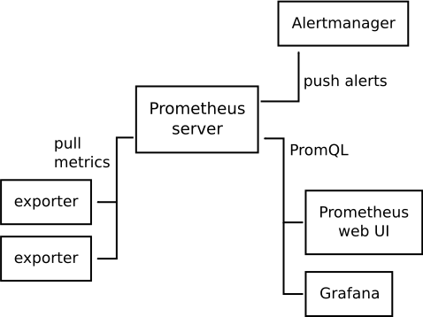

Metrics
=======



# Prometheus

Prometheus is an open-source software application used for event monitoring and alerting. 
It records real-time metrics in a time series database with flexible queries and real-time alerting. 
A simple user interface where you can visualize, query, and monitor all the metrics.

Prometheus [open](http://127.0.0.1:9090) without login and password.

#### Configure

Next, we need to configure the Prometheus to retrieve metrics. For that, we need to update a prometheus.yml file.

The targets appeared in the web interface on the [page](http://127.0.0.1:9090/targets). It`s must be in the “UP” state.

##### Targets
Further down below the ‘Configuration’ on the status page you will find a section ‘Targets’ which lists a ‘prometheus’ endpoint. 
This corresponds to the scrape_configs setting by the same job_name and is a source of metrics provided by Prometheus.
 In other words, the Prometheus server comes with a metrics endpoint - or exporter, as we called it above - which 
 reports stats for the Prometheus server itself.

# Node Exporter

Node Exporter is a Prometheus exporter for collecting server status data with pluggable metric collectors.
It allows you to measure various machine resources, such as memory, disk, and processor utilization.

Node exporter must be installed on all the machines you want to monitor (one host === one node_exporter). 
When you have a 2-3 web sites on the same host, one node_exporter it will be enough, because you have only one host for gather metrics.  

Next, we need to configure the Prometheus to retrieve metrics data. For that, we need to update a prometheus.yml file.

# Cadvisor
  
Runs to monitor containers running on the host on which the monitoring stack is deployed (i.e. monitoring all service / service containers on the stack)

Next, we need to configure the Prometheus to retrieve metrics data. For that, we need to update a prometheus.yml file.

# AlertManger

Alertmanager manages the routing of alerts which Prometheus raises to various different channels like email, pagers, slack - and so on. 
So while Prometheus collects stats and raises alerts it is completely agnostic of where these alerts should be displayed. 
This is where the alertmanager picks up.

# Grafana

Grafana is an open-source platform for data visualization, monitoring, and analysis. In Grafana, users can create dashboards with panels, each representing specific metrics over a set time-frame. Grafana supports graph, table, heatmap, and free text panels as well as integration with official and community-built plugins and apps that could be visualized too.

Grafana [open](http://127.0.0.1:3000) and use login and password:


```
user: admin
password: admin

```

Next, we need integrate Prometheus metrics (Data Sources/Prometheus). 

``` 
HTTP URL: http://prometheus:9090
```

Next, go (Dashboards/Manage/Import) and import:
 
* [Node exporter full](https://grafana.com/grafana/dashboards/1860) 
* [Docker monitoring](https://grafana.com/grafana/dashboards/193) or [Docker and system monitoring](https://grafana.com/grafana/dashboards/893) 
* [Docker Container & Host Metrics](https://grafana.com/grafana/dashboards/10619) 

There are different kinds of dashboards with different data sources at grafana dashboard home page https://grafana.com/grafana/dashboards. 
 
## Resources

[Monitoring with Prometheus, Grafana & Docker](https://finestructure.co/blog/2016/5/16/monitoring-with-prometheus-grafana-docker-part-1)

[Prometheus node exporter](https://www.shellhacks.com/ru/prometheus-node-exporter-install-config-ubuntu-centos/)

[Осваиваем мониторинг с Prometheus](https://laurvas.ru/prometheus-p1/#node-exporter-installation)
 
[Мониторинг Docker-хостов и Docker-контейнеров с помощью Prometheus+Grafana+AlertManager+Node-exporter+Cadvisor](https://kamaok.org.ua/?p=3332)

[Grafana variables](https://grafana.com/docs/grafana/latest/reference/templating/)    

[Loki](https://habr.com/ru/company/otus/blog/487118/)

## Author
[Dykyi Roman](https://www.linkedin.com/in/roman-dykyi-43428543/), e-mail: [mr.dukuy@gmail.com](mailto:mr.dukuy@gmail.com)
